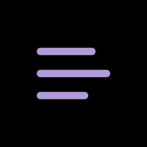

<<<<<<< HEAD
# SignCraft 3D - Neon Sign Generator

A professional web-based 3D neon sign generator for makers and small businesses. Create custom illuminated signage with integrated LED/neon light channels, ready for 3D printing.



## Features

### 🎨 Multiple Input Modes

- **Text Mode**: Create custom neon signs from text with 27+ fonts
- **Draw Mode**: Freehand drawing converted to 3D neon tubes
- **Image Mode**: Upload and trace images into bubble letter style
- **Pet Tag Mode**: Mini illuminated pet tags with 6 shape options
- **Modular Panels**: Nanoleaf-style geometric light tiles (hexagons, triangles, etc.)

### 🔧 Advanced Customization

- **Two-Part System**: Snap-fit base (holds LEDs) + translucent diffuser cap
- **Wiring Options**: Center channel, back channel, WS2812B, filament, custom
- **Mounting Patterns**: 2-point, 4-corner, 6-point, custom hole patterns
- **Geometry Modes**: Raised, stencil, layered, flat, outline
- **Material Settings**: Opaque, transparent, diffuser configurations

### 📦 Export Formats

- STL (binary) - most common for 3D printing
- OBJ (text-based)
- 3MF (ZIP with XML structure)
- Multi-part exports as ZIP with manifest.json

### ✨ Professional Features

- Real-time 3D preview with WebGL
- Snap-fit engineering with configurable tolerances
- Registration pins for part alignment
- Diffusion ribs for even light distribution
- Cable channels for clean wiring
- Mirror, weld, and feed hole options

## Tech Stack

### Frontend
- React 18 + TypeScript
- Vite for build tooling
- React Three Fiber for 3D rendering
- Zustand for state management
- Shadcn/ui components (Radix UI primitives)
- Tailwind CSS with dark/light theme

### Backend
- Node.js + Express
- Server-side STL/OBJ/3MF generation
- Opentype.js for font processing
- Hershey single-stroke fonts for centerline paths
- In-memory storage (PostgreSQL schema ready)

## Getting Started

### Prerequisites

- Node.js 18+ 
- npm or yarn

### Installation

1. Clone the repository:
```bash
git clone https://github.com/yourusername/sign-sculptor.git
cd sign-sculptor
```

2. Install dependencies:
```bash
npm install
```

3. Start the development server:
```bash
npm run dev
```

4. Open your browser to `http://localhost:5000`

### Build for Production

```bash
npm run build
npm start
```

## Project Structure

```
├── client/              # React frontend
│   ├── src/
│   │   ├── components/  # UI components
│   │   │   ├── editor/  # Editor-specific components
│   │   │   └── ui/      # Shadcn UI components
│   │   ├── pages/       # Route pages
│   │   ├── lib/         # Utilities and stores
│   │   └── hooks/       # Custom React hooks
│   └── index.html
├── server/              # Express backend
│   ├── routes.ts        # API endpoints
│   ├── stl-generator.ts # V1 solid geometry generator
│   ├── stl-generator-v2.ts # V2 swept tube generator
│   ├── pet-tag-generator.ts # Pet tag specific logic
│   ├── font-loader.ts   # Font processing
│   ├── hershey-fonts.ts # Single-stroke font support
│   └── fonts/           # Font files
├── shared/              # Shared types and schemas
│   └── schema.ts        # Zod validation schemas
└── public/              # Static assets

```

## API Endpoints

- `GET /api/fonts` - Available font options
- `GET /api/fonts/:fontId/file` - Download font file
- `GET /api/templates` - Pre-made base templates
- `POST /api/export` - Generate and download 3D files
- `POST /api/export/pet-tag` - Export pet tag designs
- `POST /api/export/modular-shape` - Export modular panels
- `GET /api/projects` - List saved projects (in-memory)
- `POST /api/projects` - Create new project
- `PATCH /api/projects/:id` - Update project
- `DELETE /api/projects/:id` - Delete project

## Usage Examples

### Creating a Neon Sign

1. Select **Text Mode** from the tool dock
2. Enter your text (e.g., "OPEN")
3. Choose a font (e.g., "Aerioz" for neon script)
4. Adjust settings:
   - Letter height and depth
   - Enable two-part system for snap-fit design
   - Configure LED channel width
   - Add mounting holes if needed
5. Click **Export** and download your STL files

### Drawing Custom Shapes

1. Select **Draw Mode**
2. Draw freehand on the canvas
3. Strokes are converted to 3D tubes automatically
4. Adjust tube diameter and wall height
5. Export as two-part system with diffuser cap

### Creating Pet Tags

1. Select **Pet Tag Mode**
2. Enter pet name
3. Choose tag shape (bone, heart, etc.)
4. Enable LED channel for illumination
5. Configure hang position
6. Export base + cap for mini neon effect

## Configuration

### Environment Variables

- `PORT` - Server port (default: 5000)
- `NODE_ENV` - Environment mode (development/production)
- `DATABASE_URL` - PostgreSQL connection (optional, not currently used)

### Font Management

Add custom fonts by:
1. Placing TTF/OTF files in `server/fonts/`
2. Adding font entry to `fontFileMap` in `server/routes.ts`
3. Adding font option to `fontOptions` in `shared/schema.ts`

## Design Philosophy

SignCraft 3D follows an **editor-first interface** design inspired by:
- **Figma**: Maximize canvas space, accessible tools
- **Tinkercad**: Intuitive 3D manipulation
- **Linear**: Clean utility aesthetics

Key principles:
- All controls within 1-2 clicks
- Non-destructive workflow for easy experimentation
- Professional utility over flashy visuals
- Real-time preview with instant feedback

## Known Limitations

- Projects stored in memory only (resets on server restart)
- No user authentication (schema ready but not implemented)
- Limited pre-made template library (4 templates)
- No frontend UI for project save/load (API exists)

## Contributing

Contributions welcome! Please:
1. Fork the repository
2. Create a feature branch
3. Make your changes
4. Submit a pull request

## License

MIT License - see LICENSE file for details

## Acknowledgments

- Font support via [Opentype.js](https://opentype.js.org/)
- Hershey fonts for single-stroke geometry
- 3D rendering with [React Three Fiber](https://docs.pmnd.rs/react-three-fiber)
- UI components from [Shadcn/ui](https://ui.shadcn.com/)

## Support

For issues, questions, or feature requests, please open an issue on GitHub.

---

**Built for makers, by makers.** Create professional neon signs for your business, home, or projects.
=======
"# SignMaker3D" 
>>>>>>> 33504e4ace41721bd6457f6819efef6d26850a39
